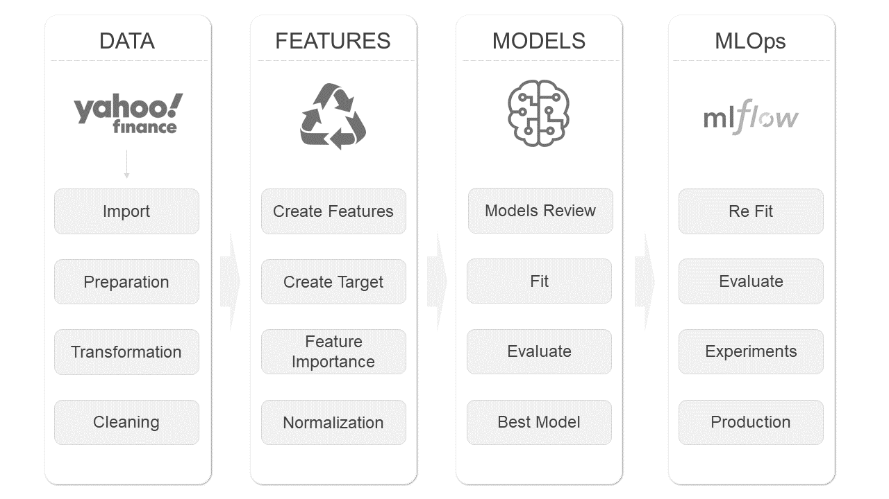

# US Financials

## Forecast the success of US stocks on the background of `S&P 500` index

### Project Flow

### Command utility `manage.py`

In main project directory:
- `python manage.py makecleandata` - run module for cleaning data
- `python manage.py makefeatures` - run module for creating new features
- `python manage.py maketrain` - run module for training model
- `python manage.py makepredict` - run module for predicting class of stocks